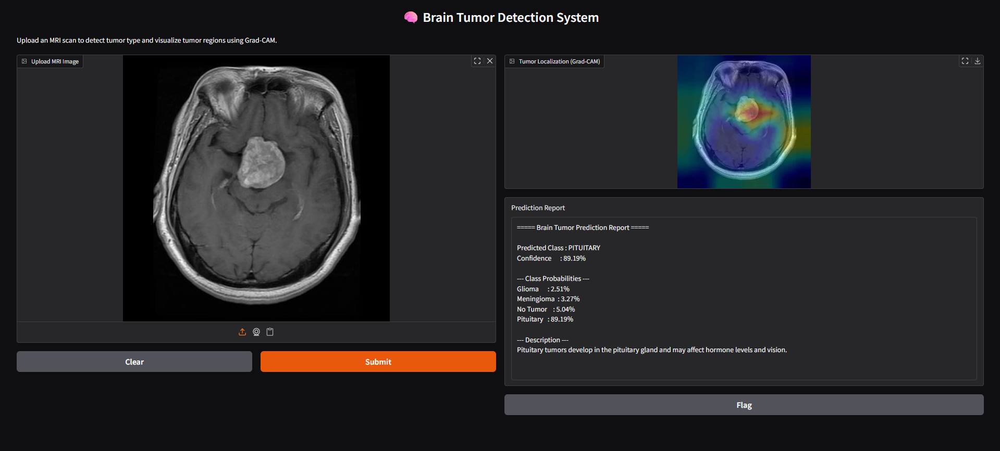
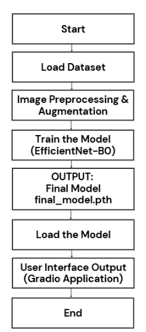
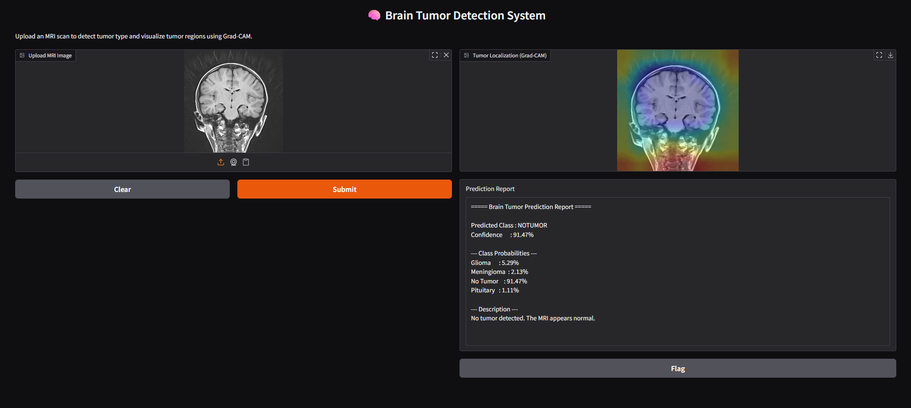
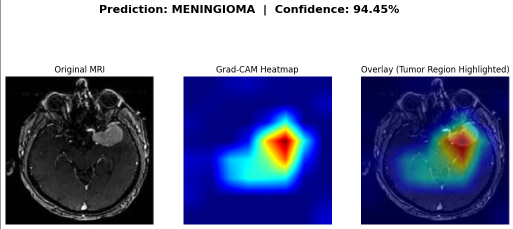
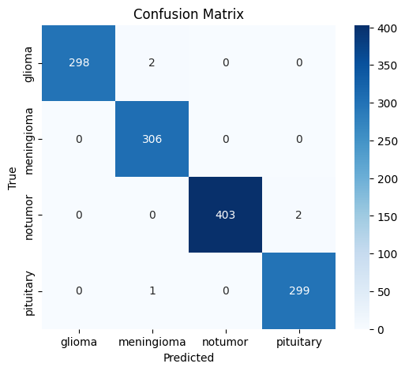
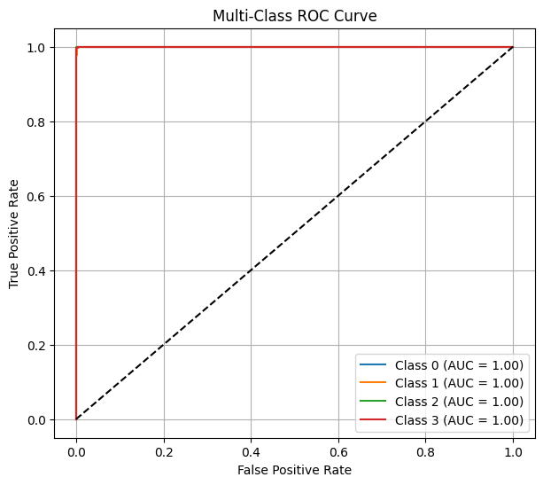
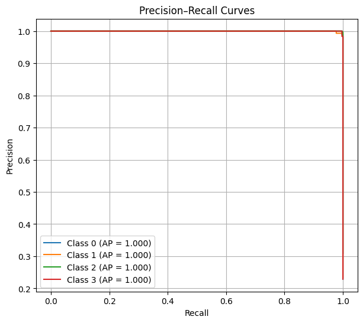

# 🧠 Brain Tumor Classification from MRI Images using Deep Learning


A deep learning-based system for automated brain tumor classification from MRI scans using **EfficientNet-B0**, transfer learning, and **Grad-CAM explainability**.

The model classifies brain MRI images into four categories:

* Glioma
* Meningioma
* Pituitary Tumor
* No Tumor

---

## 📸 Project Preview



---

## ✨ Features

* Brain tumor classification using EfficientNet-B0
* Transfer learning with ImageNet pretrained weights
* MRI image preprocessing and augmentation
* Explainable AI using Grad-CAM
* Gradio-based interactive web interface
* Confusion matrix and classification report
* ROC and Precision-Recall analysis
* Mixed Precision Training (AMP)
* Optimized training using AdamW and Cosine Annealing Scheduler
* High classification accuracy

---

## ⚙️ System Workflow

The overall workflow of the proposed system is illustrated below.



---

## 🏥 Tumor Classes

| Class      | Description                          |
| ---------- | ------------------------------------ |
| Glioma     | Tumors originating from glial cells  |
| Meningioma | Tumors arising from the meninges     |
| Pituitary  | Tumors affecting the pituitary gland |
| No Tumor   | Normal MRI scan                      |

---

## 📂 Dataset

This project uses the **Brain Tumor MRI Dataset** available on Kaggle.

🔗 **Dataset:** [Brain Tumor MRI Dataset](https://www.kaggle.com/datasets/masoudnickparvar/brain-tumor-mri-dataset)

The dataset contains **over 7,000 MRI images** categorized across four classes:

* Glioma
* Meningioma
* Pituitary Tumor
* No Tumor

### Dataset Structure

```text
Dataset/
│
├── Training/
│   ├── Glioma/
│   ├── Meningioma/
│   ├── Pituitary/
│   └── NoTumor/
│
└── Testing/
    ├── Glioma/
    ├── Meningioma/
    ├── Pituitary/
    └── NoTumor/
```

---

## 🛠️ Tech Stack

### Deep Learning Framework

* PyTorch

### Model

* EfficientNet-B0

### Libraries

* OpenCV
* NumPy
* Albumentations
* Matplotlib
* Scikit-learn
* timm
* Gradio

### Development Environment

* Google Colab
* Jupyter Notebook

---

## 🧠 Model Architecture

* EfficientNet-B0
* Transfer Learning
* CrossEntropy Loss with Label Smoothing
* AdamW Optimizer
* Cosine Annealing Learning Rate Scheduler
* Mixed Precision Training (AMP)

---

## 📊 Performance

| Metric    |  Score |
| --------- | -----: |
| Accuracy  | 99.62% |
| Precision | 99.59% |
| Recall    | 99.63% |
| F1 Score  | 99.61% |

---

## 📈 Evaluation Metrics

* Accuracy
* Precision
* Recall
* F1 Score
* Confusion Matrix
* Classification Report
* ROC Curve
* Precision-Recall Curve

---

## 🔍 Sample Prediction

The figure below shows a sample prediction generated by the model along with the confidence scores.



---

## 🔥 Grad-CAM Visualization

Grad-CAM is used to visualize the regions responsible for the model's predictions, improving interpretability and increasing trust in the classification results.



---

## 📊 Confusion Matrix

The confusion matrix summarizes the classification performance of the model across all tumor categories.



---

## 📈 ROC Curve

The ROC curve demonstrates the model's discriminative ability for each class.



---

## 📉 Precision-Recall Curve

The Precision-Recall curves provide insights into the trade-off between precision and recall across classes.



---

## 📁 Project Structure

```text
Brain-Tumor-Classification/
│
├── braintumorproject.ipynb
├── result.ipynb
├── best_model_fast.pth
├── requirements.txt
├── README.md
└── images/
    ├── gradio_interface.png
    ├── workflow.png
    ├── sample_prediction.png
    ├── gradcam_output.png
    ├── confusion_matrix.png
    ├── roc_curve.png
    └── precision_recall_curve.png
```
---

## 📂 Project Files

### 📓 Training Notebook

Train the model using the Google Colab notebook:

🔗 [braintumorproject.ipynb](https://colab.research.google.com/drive/1Q1m1AlssWkl2rpfqC7bGzoNv_m9DK-hA?usp=sharing)

---

### 📓 Inference and Gradio Interface Notebook

Run inference and launch the Gradio application:

🔗 [result.ipynb](https://colab.research.google.com/drive/1rZnyXM8UEUZtQZ6ETWIOIj71KVQGON8T?usp=sharing)

---

### 🧠 Pretrained Model Weights

Download the trained EfficientNet-B0 model:

🔗 [best_model_fast.pth](https://drive.google.com/file/d/11kBNG695CRjAuZGjPuPGKJoVv0hg18mv/view?usp=sharing)

---


## 🚀 Installation

Clone the repository:

```bash
git clone https://github.com/saaiii06/Brain-Tumor-Classification.git
```

Navigate to the project directory:

```bash
cd Brain-Tumor-Classification
```

Install the required dependencies:

```bash
pip install -r requirements.txt
```

---

## ▶️ Usage

### Training

Open and run:

```text
braintumorproject.ipynb
```

### Inference and Gradio Interface

Open and run:

```text
result.ipynb
```

---

## 🔮 Future Improvements

* Brain tumor segmentation
* Multi-modal medical imaging
* Real-time clinical deployment
* Cloud-based diagnosis systems
* Ensemble learning approaches
* Training on larger and more diverse datasets

---

## 📜 License

This project is licensed under the MIT License.

---

⭐ If you found this project useful, consider giving it a star!

